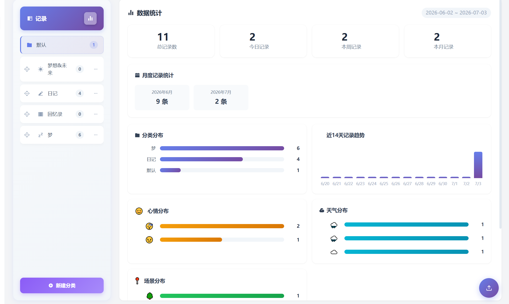
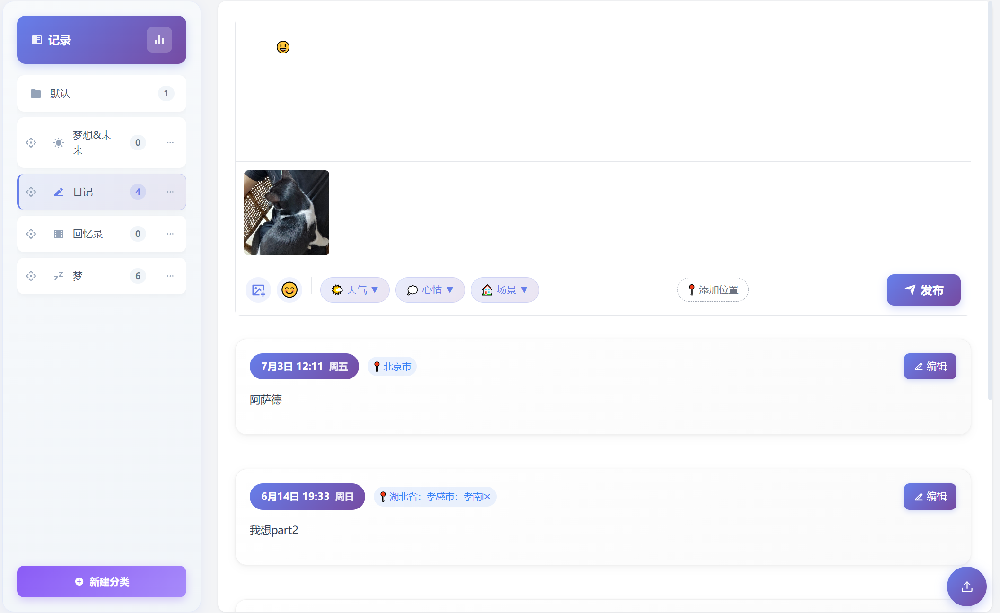
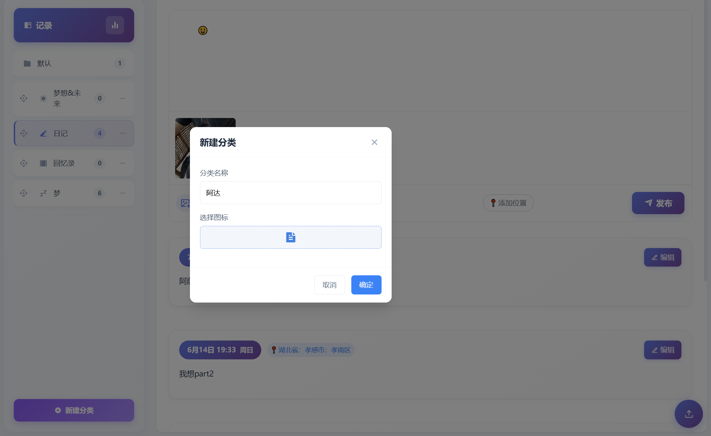
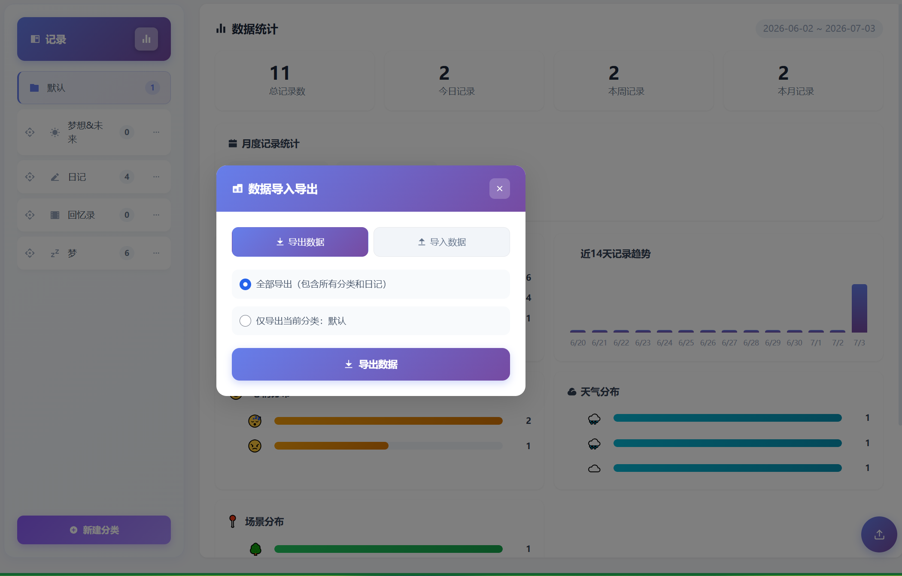
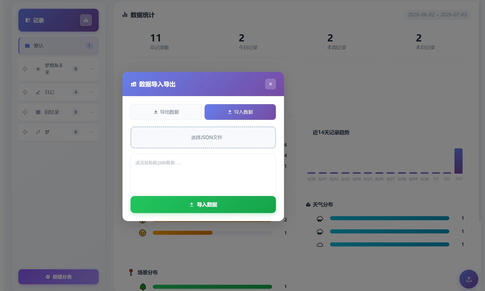

# 心灵回响 (Psyche Echo)

> Halo 个人笔记记录插件 - 记录日记、心情、想法和生活点滴

[](https://github.com/miany/psyche-echo/actions/workflows/ci.yaml)
[](https://github.com/miany/psyche-echo/actions/workflows/cd.yaml)
[](https://www.gnu.org/licenses/gpl-3.0.html)
[](https://halo.run)

---

## 📸 功能截图











## ✨ 功能特性

- 📝 **笔记管理**：创建、编辑、删除个人笔记
- 📁 **分类管理**：为笔记创建自定义分类
- 🖼️ **媒体支持**：支持在笔记中添加图片和媒体文件
- 📊 **访问统计**：记录笔记的访问次数和统计数据
- 🎨 **图标选择**：为分类自定义图标
- 😊 **表情支持**：在笔记中添加表情符号
- 🌤️ **天气标记**：为笔记添加天气信息
- 💭 **心情记录**：记录当时的心情状态
- 🏠 **场景标记**：记录笔记的场景（室内/户外）
- 📤 **数据导入导出**：支持 JSON 格式的数据备份和恢复

## 🛠️ 技术栈

- **后端**：Java 21 + Spring Boot + Reactor
- **前端**：Vue 3 + TypeScript + RSBuild
- **框架**：Halo 2.23.0+ Extension 机制

## 🚀 快速开始

### 安装要求

- Halo >= 2.23.0
- Java >= 21

### 安装方式

1. **从 Halo 应用市场安装**（推荐）
   - 打开 Halo 管理后台
   - 进入「应用」->「应用市场」
   - 搜索「心灵回响」或「psyche-echo」
   - 点击安装即可

2. **手动安装**
   ```bash
   # 下载最新版本的插件 JAR 文件
   wget https://github.com/Little-Mianyang/psyche-echo/releases/latest/download/psyche-echo.jar
   
   # 将 JAR 文件复制到 Halo 插件目录
   cp psyche-echo.jar /path/to/halo/plugins/
   ```

### 使用说明

1. 安装插件后，在 Halo 管理后台左侧菜单找到「心灵回响」
2. 点击进入后可以：
   - 创建新笔记
   - 管理笔记分类
   - 查看和编辑已有笔记
   - 查看统计数据
   - 导入/导出数据

## 📖 详细使用指南

### 创建笔记

1. 点击右上角「新建」按钮
2. 在编辑器中输入笔记内容
3. （可选）添加图片或媒体文件
4. （可选）选择天气、心情、场景等标签
5. 点击「保存」完成

### 分类管理

1. 点击左侧分类列表旁的「+」按钮
2. 输入分类名称
3. 选择自定义图标
4. 点击「确定」创建

### 数据导入导出

- **导出**：点击工具栏「导出」按钮，下载 JSON 格式的备份文件
- **导入**：点击工具栏「导入」按钮，选择之前导出的 JSON 文件

## 🔧 开发指南

### 开发环境

- Java 21+
- Node.js 18+
- pnpm

### 开发命令

```bash
# 启动 Halo 开发服务器（包含插件）
./gradlew haloServer

# 开发前端（需要先进入 ui 目录）
cd ui
pnpm install
pnpm dev
```

### 构建命令

```bash
# 构建完整插件
./gradlew build

# 仅构建前端
cd ui
pnpm build
```

构建完成后，可以在 `build/libs` 目录找到插件 JAR 文件。

### 项目结构

```
psyche-echo/
├── src/main/java/com/miany/psycheecho/
│   ├── config/          # 配置类
│   ├── content/         # 内容模型
│   ├── dto/             # 数据传输对象
│   ├── endpoint/        # API 端点
│   ├── service/         # 业务逻辑
│   └── PsycheEchoPlugin.java  # 插件主类
├── src/main/resources/
│   ├── openapi/         # API 文档
│   ├── logo.png         # 插件图标
│   └── plugin.yaml      # 插件配置
├── ui/                  # 前端代码
├── build.gradle         # 构建配置
└── README.md            # 项目说明
```

## 🔌 API 接口

### 笔记接口

| 方法 | 路径 | 描述 |
|------|------|------|
| GET | `/apis/api.echo.miany.run/v1alpha1/notes` | 获取笔记列表 |
| GET | `/apis/api.echo.miany.run/v1alpha1/notes/{name}` | 获取单条笔记 |
| POST | `/apis/api.echo.miany.run/v1alpha1/notes` | 创建笔记 |
| PUT | `/apis/api.echo.miany.run/v1alpha1/notes/{name}` | 更新笔记 |
| DELETE | `/apis/api.echo.miany.run/v1alpha1/notes/{name}` | 删除笔记 |

### 分类接口

| 方法 | 路径 | 描述 |
|------|------|------|
| GET | `/apis/api.echo.miany.run/v1alpha1/categories` | 获取分类列表 |
| GET | `/apis/api.echo.miany.run/v1alpha1/categories/{name}` | 获取分类详情 |
| POST | `/apis/api.echo.miany.run/v1alpha1/categories` | 创建分类 |
| PUT | `/apis/api.echo.miany.run/v1alpha1/categories/{name}` | 更新分类 |
| DELETE | `/apis/api.echo.miany.run/v1alpha1/categories/{name}` | 删除分类 |

## 🔒 隐私政策

本插件尊重并保护用户的个人隐私权益：

- **数据收集**：不收集或传输任何用户的个人身份信息
- **数据存储**：所有笔记数据仅存储在用户的 Halo 站点本地
- **第三方服务**：使用 BigDataCloud 提供的免费逆地理编码 API（api.bigdatacloud.net）将经纬度坐标转换为城市名称，该服务无需 API Key
- **位置信息**：仅在用户主动点击授权后，通过浏览器原生 API 获取经纬度坐标

## 📝 更新日志

### v1.0.0 (2024-01-01)

- ✨ 初始版本发布
- 📝 支持笔记创建、编辑、删除
- 📁 支持分类管理
- 🖼️ 支持媒体文件
- 📊 支持统计功能

## 🤝 贡献指南

欢迎提交 Issue 和 Pull Request！

1. Fork 本仓库
2. 创建功能分支 (`git checkout -b feature/your-feature`)
3. 提交更改 (`git commit -am 'Add some feature'`)
4. 推送到分支 (`git push origin feature/your-feature`)
5. 创建 Pull Request

## 📄 许可证

[GPL-3.0](https://www.gnu.org/licenses/gpl-3.0.html) © Little-Mianyang

## 👤 作者

- **miany** - [Gitee](https://gitee.com/Little-Mianyang) | [GitHub](https://github.com/miany)

---

**如果这个项目对你有帮助，请给它一个 ⭐！**
